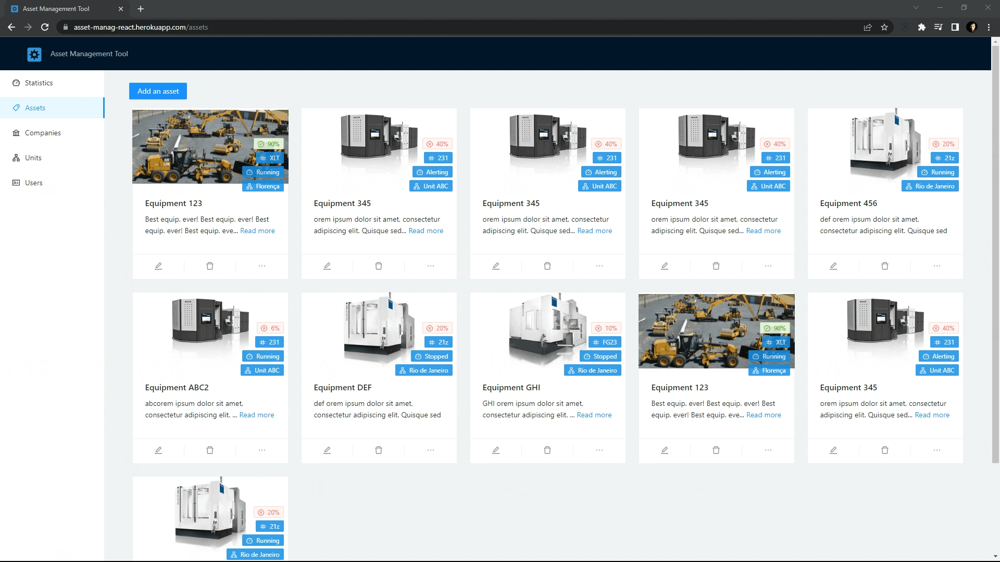

# 🛠️ Assets Management

Full responsive CRUD app where the user can register companies, units, assets and users.

See a live demo here: [https://asset-manag-react.herokuapp.com/](https://asset-manag-react.herokuapp.com/).

## 🎯 Requirements

- Each asset must have an image, name, description, model, owner, status and health level;
- Each asset is part of a unit;
- Each unit is part of a company;
- Every user is part of a company;
- There are three types of status: Running, Alerting, Stopped;
- Health level needs to be between 0% to 100%.

Design created with Ant Design and connection to backend and cache management with Apollo Client.

## 📌 Screenshots

- Statistics Page

- Assets Page

- Other Pages

## 🔧 Backend

Backend code here: [https://github.com/luisggc/assets_management_backend](https://github.com/luisggc/assets_management_backend).

Live backend: [https://assets-manag.herokuapp.com/graphql](https://assets-manag.herokuapp.com/graphql).
